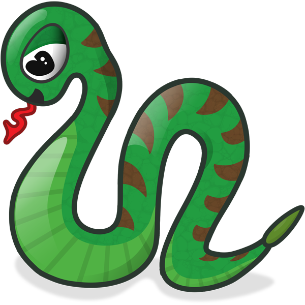

# Snake
A clone of the classic game Snake where the user controls a snake made of block 
segments to collect food pieces. The snake's body grows upon each collection 
of food, and the goal is to collect as much food as possible and grow the 
snake as large as possible while avoiding collision with game boundaries 
and not colliding snake's body into itself.

# Installation
Clone this repo to any directory you so choose

`git clone https://github.com/recursive-redundancy/snake-web-browser.git`

Then from within that directory install project dependencies

`npm install`

There are a few dependencies that you should install globally since
they will be called via the command-line by certain npm scripts, and 
as such your system needs to be aware of these commands to work properly.

`npm install -g webpack webpack-dev-server rimraf http-server`

# Development
The package.json includes a npm script for running a development server and
testing within a web browser

`npm start`

...this will start the webpack-dev-server and is accessed via web browser
at http://localhost:8080

# Production
The package.json includes a npm script for running a production build served
via http-server and accessed at http://localhost:8080

`npm run prod:test`

this will run the prod:build script which builds the production bundle in 
./dist directory and then runs the prod:server for the http-server

# Playable Example
Game is hosted live and can be played on my website at: http://snake.danielmorgan.me

# License
[MIT](https://github.com/recursive-redundancy/snake-web-browser/blob/master/license.txt)
